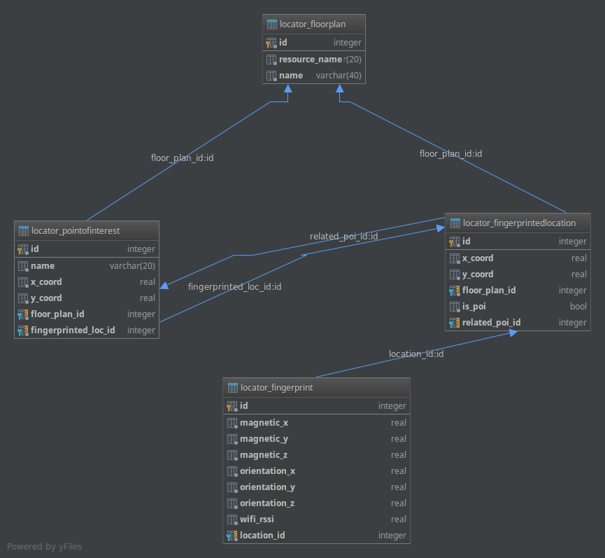

# Indoor locator server

This server is to support the [indoor locator](https://github.com/Indoor-Positioning/indoor-locator) android app.
The client (android app) talks via a websocket - powered by [django channels](https://channels.readthedocs.io/en/stable/) - to the server
in order to add Point of Interests, Finger Printed locations, and Fingerprints, and retrieve the matched 
location from the server.

### Deploy

* Install requirements stored in requirements.txt
* Deploy local Redis server (should listen at port 6379)
* Run django server.

Database Schema:



#### Tables Explanation

* `Floor Plan`. Stores the floor plans. Must be added beforehand, by the django admin. The resource_name corresponds to the drawable png that should reside
in the android apk.
* `PointOfInterest`. Stores the POIs of the current floor plan. These can be paintings / statues on a museum, etc
* `FingerPrintedLocation`. Stores the locations that are about to be fingerprinted.
* `FingerPrint`. Stores the fingerprint of the various locations.

_Note:_ There is a strange cycle dependency between the `PointOfInterest` and `FingerPrintLocation` table. The concept is that
every PointOfInterest has an entry on the FingerPrintedLocation table (we need that in order to store the fingerprint of each POI), while
at the same time we want each FingerPrintedLocation to be related with exactly one POI which will be either the closest one (if the FingerPrintedLocation is not a POI),
or the POI itself (if the FingerPrintedLocation is a POI (i.e isPoi = True)). I will come back to it and probably reconsider.

### Supported Commands

1. `GET_FLOOR_PLANS`.

This command is sent by the client so as to retrieve the floor plans which are currently saved in the database.

```json
{
  "command" : "GET_FLOOR_PLANS" 
}
```

The server responds with a json of the following form:

```json
[
    {
      "id" : "<floor_plan_id>",
      "name" : "<floor_plan_name>",
      "resourceName" : "<resource_name_of_floor_plan_image>"
    }
]

```

2. `GET_LOCATIONS`

This command is sent by the client to retrieve the locations which are fingerprinted inside the requested floorPlan

```json
{ 
  "command" : "GET_LOCATIONS", 
  "floorPlanId" : "<floor_plan_id>"
}
```
The server responds with the saved locations in the database:

```json
[
    {
      "id" : "<point_of_interest_id>",
      "floorPlanId" : "<floor_plan_id of the requested locations>",
      "relatedFingerPrintedLocId" : "<the related entry in the FingerPrintedLocation table>",
      "relatedPoi" : "<the related (closest) POI id - this may also be the POI it self if isPoi is true",
      "isPoi" : "<True if this entry is a POI / False otherwise>",
      "xCoord" : "<the X coordinate of the location with respect to the floor plan>",
      "yCoord" : "<the X coordinate of the location with respect to the floor plan>"
    }
]

```


3. `GET_POIS`

This command is sent by the client to retrieve the locations which are fingerprinted inside the requested floorPlan

```json
{ 
  "command" : "GET_POIS", 
  "floorPlanId" : "<floor_plan_id>"
}
```

The server responds with the saved Points of Interest in the database:

```json
[
    {
      "id" : "<point_of_interest_id>",
      "name" : "<point_of_interest_name (if applicable) or else N/A>",
      "floorPlanId" : "<floor_plan_id of the requested POIs>",
      "relatedFingerPrintedLocId" : "<the related entry in the FingerPrintedLocation table>",
      "xCoord" : "<the X coordinate of the POI with respect to the floor plan>",
      "yCoord" : "<the X coordinate of the POI with respect to the floor plan>"
    }
]

```

4. `ADD_LOCATION`

This command is sent by the client to add a new location to the floor plan (user taps on the floor plan image, then coordinates are captured)

```json
{ 
  "command" : "ADD_LOCATION", 
  "location" :
  {
        "floorPlanId" : "<floor_plan_id",
        "isPoi" : "False",
        "xCoord" : "<x_coordinate>",
        "yCoord" : "<Y_coordinate>"
  }
}
```
The server responds with the newly added location:

```json
  {
        "id" : "<new_location_id>",
        "floorPlanId" : "<floor_plan_id",
        "relatedPoi" : "-1 ; Must be added later by the floor plan administrator",
        "isPoi" : "False",
        "xCoord" : "<x_coordinate>",
        "yCoord" : "<Y_coordinate>"
  }

```


5. `ADD_POI`

This command is sent by the client to add a new POI to the floor plan (user long taps on the floor plan image, then coordinates are captured)
A respective FingerPrintedLoc entry is added to the database (see the schema for more details).

```json
{ 
  "command" : "ADD_POI", 
  "poi" :
  {
        "floorPlanId" : "<floor_plan_id",
        "xCoord" : "<x_coordinate>",
        "yCoord" : "<Y_coordinate>"
  }
}
```
The server responds with the newly added location:

```json
  {
        "id" : "<new_poi_id>",
        "floorPlanId" : "<floor_plan_id",
        "name" : "<empty ; Must be added later by administrator",
        "relatedFingerPrintedLocId" : "The id of the respective FingerPrintedLocationId that was created along with this POI",
        "xCoord" : "<x_coordinate>",
        "yCoord" : "<Y_coordinate>"
  }

```

6. `ADD_FINGERPRINTS`


7. `LOCATE`
